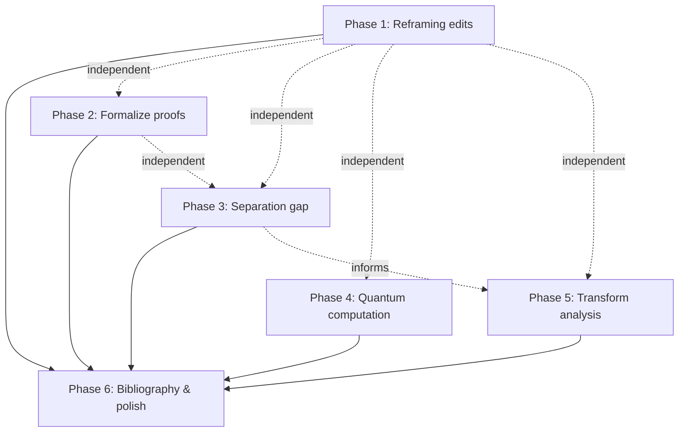

# Implementation Plan: Paper 1 — Spectral Entropy of Modular Multiplication

## Current State Assessment

Paper 1 is substantially further along than Paper 2. The core mathematics is correct, the empirical validation is done through N=1000 (detection) and N=2000 (separation gap), and the writing is already at a near-publishable level. The main weaknesses are:

1. **Novelty framing** — the core result is presented as if it's new when it's a known consequence of finite field theory
2. **Proof gaps** — the converse direction of Theorem 2 is prose, not proof
3. **Misleading claims** — the O(1) space complexity and the lack of honest comparison with existing primality tests
4. **Speculative sections without computation** — the quantum mechanics section
5. **Shallow conjecture support** — separation gap only tested to N=2000
6. **Zero references** — no bibliography at all

The plan below addresses each of these systematically.

---

## Phase 1: Reframing and Honesty Edits
**Goal:** Make the paper honest about what's known, what's new, and what the limitations are.
**Estimated effort:** 1 session (text edits only, no code)

### Task 1.1 — Rewrite the Introduction

The introduction currently jumps straight into the matrix definition. It needs a paragraph acknowledging prior work:

- [ ] Add a paragraph noting that the connection between $\mathbb{Z}/n\mathbb{Z}$ being a field and the uniformity of the multiplication table is classical algebra
- [ ] Explicitly state what the *new contributions* are:
  1. The Spectral Remainder Transform as a complex-analytic encoding
  2. The continuous entropy signal $S(x)$ as a non-circular primality detector
  3. The empirical separation gap conjecture
  4. The quantum mechanical interpretation
- [ ] Frame the paper as: "We take a known algebraic fact, embed it in complex analysis, and discover that the resulting analytic structure enables continuous, gradient-based prime detection"

### Task 1.2 — Fix the complexity analysis (§4)

- [ ] Change the $\mathcal{O}(1)$ space claim to $\mathcal{O}(n)$ auxiliary space (you need at least a loop counter and the running residue sum — and evaluating the sum requires $\mathcal{O}(n^2)$ terms in the inner loop, each needing $\mathcal{O}(1)$ space, so total auxiliary is $\mathcal{O}(1)$ per evaluation but $\mathcal{O}(n)$ for the residue accumulator across all $n$ targets). Clarify what "space" means here.
- [ ] Add a subsection §4.4: "Comparison with Existing Primality Tests" — a frank table:

| Method | Time | Space | Deterministic? |
|--------|------|-------|----------------|
| Trial division | $\mathcal{O}(\sqrt{n})$ | $\mathcal{O}(1)$ | Yes |
| Miller-Rabin | $\mathcal{O}(k \log^2 n)$ | $\mathcal{O}(\log n)$ | Probabilistic |
| AKS | $\tilde{\mathcal{O}}(\log^6 n)$ | $\mathcal{O}(\log^2 n)$ | Yes |
| Entropy matrix (discrete) | $\mathcal{O}(n^2 \log n)$ | $\mathcal{O}(n^2)$ | Yes |
| Entropy signal $S(x)$ | $\mathcal{O}(N \cdot n^2)$ | $\mathcal{O}(N)$ | Yes |

- [ ] Add a sentence: "The entropy-based approach is not competitive with existing primality tests in raw computational efficiency. Its value lies in the continuous analytic structure it provides, which enables gradient-based search (§6) and connections to physics (§8)."

### Task 1.3 — Clean up the $S(x)$ discussion

- [ ] In §5.1, note explicitly that computing $S(x)$ at a single point requires knowing $\Delta(n)$ for all $n \leq N$, and each $\Delta(n)$ requires $\mathcal{O}(n^2)$ work
- [ ] Clarify that $S(x)$ is not a primality *test* for a single number — it's a *landscape* that reveals the global distribution of primes up to $N$
- [ ] This is actually a strength: unlike pointwise tests, $S(x)$ gives you a differentiable function whose analytic properties (zeros, extrema, curvature) encode the prime distribution

### Deliverable
An intellectually honest paper that a reviewer can't dismiss for overclaiming.

---

## Phase 2: Formalize the Converse Proof
**Goal:** Turn the prose argument for "composite ⇒ strictly less than max entropy" into a proper proof.
**Estimated effort:** 1 session (mostly LaTeX)

### Task 2.1 — Split Theorem 2

Currently Theorem 2 tries to do everything. Restructure as:

- [ ] **Lemma 3 (Prime direction):** If $n$ is prime, then $p(s) = 1/(n-1)$ for $s \in \{1, \dots, n-1\}$ and $p(0) = 0$, so $H(P_n) = \log_2(n-1)$.
  - Proof: bijection argument (already written, just move it)

- [ ] **Lemma 4 (Composite direction):** If $n$ is composite, then $p(0) > 0$, and $H(P_n) < \log_2(n-1)$.
  - Proof needs to be tightened (see Task 2.2)

- [ ] **Theorem 2 (restated):** $H(P_n) = \log_2(n-1) \iff n$ is prime. (Follows from Lemmas 3 and 4.)

### Task 2.2 — Write the converse proof properly

The current argument says "zero divisors exist" and "rows prematurely loop" but doesn't formally show $H < \log_2(n-1)$. The proof needs:

- [ ] **Step 1:** If $n$ is composite, $\exists\, a, b \in \{1, \dots, n-1\}$ with $ab \equiv 0 \pmod{n}$. Therefore $p(0) > 0$.
- [ ] **Step 2:** Since $p(0) > 0$ and $\sum p(s) = 1$, the distribution is supported on $\{0, 1, \dots, n-1\}$ (all $n$ values) but is *not* uniform over any subset of size $n-1$.
- [ ] **Step 3:** The uniform distribution over $n-1$ symbols achieves $\log_2(n-1)$. The uniform distribution over $n$ symbols achieves $\log_2(n) > \log_2(n-1)$. But our distribution is not uniform over *either* set. Apply the strict concavity of $-x\log x$ to conclude $H < \log_2(n-1)$.
- [ ] **The subtle point:** You need to show it's not just $p(0) > 0$ but that the *non-zero* residues are also non-uniform. This follows from the row structure: if $\gcd(j, n) = g > 1$, row $j$ produces only multiples of $g$, concentrating mass on a subset.

### Task 2.3 — Clean up the $H_{\text{actual}}$ definition

- [ ] Move the definition of $H_{\text{actual}}(n)$ (the residue-based entropy) out of the theorem and into a standalone definition block
- [ ] The equivalence $H_{\text{actual}}(n) = H(P_n)$ is immediate from the Residue–Count Identity — state it as a corollary, not as part of the theorem

### Deliverable
A clean theorem–proof structure that a referee can follow line by line.

---

## Phase 3: Strengthen the Separation Gap
**Goal:** Push empirical evidence further and develop a heuristic theory.
**Estimated effort:** 1–2 sessions

### Task 3.1 — Extend computation to N=10,000

- [ ] Optimize `delta_analysis.py` for larger $N$:
  - The inner loop is $\mathcal{O}(n^2)$ per integer; for $N = 10{,}000$ this is $\sum_{n=2}^{10000} n^2 \approx 3.3 \times 10^{11}$ operations
  - Use NumPy vectorization: precompute `np.outer(range(1,n), range(1,n)) % n` and use `np.bincount`
  - Consider Cython or Numba JIT for the inner loop
  - Estimate runtime and decide if 10,000 is feasible or if we stop at 5,000
- [ ] Create `spectral-entropy/scripts/delta_analysis_extended.py`
- [ ] Track: does $n = 10$ remain the global minimum? Do any new semiprimes $p \cdot q$ with large $p, q$ approach $\Delta(10)$?

### Task 3.2 — Theoretical analysis of small semiprimes

- [ ] For $n = pq$ (semiprime, $p < q$), derive an explicit formula for $\Delta(pq)$ in terms of $p$ and $q$
- [ ] The multiplication table mod $pq$ has a known structure via CRT: $\mathbb{Z}/pq\mathbb{Z} \cong \mathbb{Z}/p\mathbb{Z} \times \mathbb{Z}/q\mathbb{Z}$
- [ ] Count exact occurrences of each residue:
  - Elements coprime to $n$: $\phi(n) = (p-1)(q-1)$ of them, appearing with one frequency
  - Multiples of $p$ (not $q$): $q-1$ of them
  - Multiples of $q$ (not $p$): $p-1$ of them
  - Zero: appears with frequency related to the zero-divisor count
- [ ] Derive $H(P_{pq})$ as a closed-form function of $p$ and $q$
- [ ] Show that $\Delta(pq)$ is minimized when $p$ and $q$ are close together and small — this would explain why $\Delta(10) = \Delta(2 \times 5)$ is the global minimum
- [ ] Create `spectral-entropy/scripts/semiprime_entropy.py` implementing this analysis

### Task 3.3 — Investigate near-miss composites

- [ ] For each composite type (prime squares $p^2$, semiprimes $pq$, prime cubes $p^3$, products of 3 primes), plot $\Delta$ vs $n$ and look for convergence behavior
- [ ] Specifically check: does $\Delta(p^2) \to 0$ as $p \to \infty$? (If yes, the conjecture is false.)
- [ ] Check semiprimes $p(p+2)$ for twin primes — these produce near-square multiplication tables

### Task 3.4 — New figure for the paper

- [ ] **New Figure 2:** $\Delta(n)$ for composites up to N=10,000, colored by type (semiprime, prime power, other), with $\Delta(10)$ marked
- [ ] **New Figure 3:** $\Delta(pq)$ as a function of $p$ for fixed $q$ (showing the dependence on factor structure)

### Deliverable
Either stronger evidence for the conjecture (with a heuristic proof sketch for semiprimes), or a counterexample that disproves it. Both are valuable.

---

## Phase 4: Quantum Band Structure Computation
**Goal:** Replace the speculative §8 with actual calculations.
**Estimated effort:** 2 sessions

### Task 4.1 — Solve the Kronig-Penney model on the ring

The Hamiltonian for a particle on a ring with delta-function potentials at the $n$-th roots of unity is exactly solvable. The energy eigenvalues come from matching boundary conditions at each delta well.

- [ ] Create `spectral-entropy/scripts/quantum_ring.py`
- [ ] **For the prime case** (uniform delta wells at $(n-1)$ equally spaced points):
  - This is the textbook Kronig-Penney model on a periodic ring
  - The eigenvalue equation is: $\cos(n k a) = \cos(k a) - \frac{m V_0 a}{\hbar^2 k} \sin(k a)$
  - Solve numerically for the allowed energy bands $E_k$
  - Plot the band structure: $E$ vs. crystal momentum $k$

- [ ] **For the composite case** (non-uniform delta wells):
  - The wells have different depths (proportional to residue counts)
  - Some positions have no well at all (residues that don't appear)
  - Solve the transfer matrix equation numerically:
    - At each delta well, the transfer matrix is $M_s = \begin{pmatrix} 1 & 0 \\ -2mV_s/\hbar^2 & 1 \end{pmatrix}$
    - Between wells, free propagation: $M_{\text{free}} = \begin{pmatrix} \cos(k d) & \sin(k d)/k \\ -k\sin(k d) & \cos(k d) \end{pmatrix}$
    - The eigenvalue condition is $|\text{Tr}(M_{\text{total}})| \leq 2$
  - Plot the resulting (broken) band structure

### Task 4.2 — Visualize prime vs. composite spectra

- [ ] **Figure: Band structure comparison**
  - Side-by-side: $n = 7$ (prime) vs $n = 6$ (composite) vs $n = 12$ (highly composite)
  - Show the clean bands for primes vs. the shattered, gapped bands for composites
- [ ] **Figure: Energy level statistics**
  - Compute the nearest-neighbor spacing distribution $P(s)$ for energy levels
  - For primes: should approach Wigner–Dyson (GOE) statistics if the Random Matrix Theory connection holds
  - For composites: should approach Poisson statistics (uncorrelated levels)
  - This directly tests the paper's claim about the connection to quantum chaos

### Task 4.3 — Wavefunction localization

- [ ] Solve for the actual wavefunctions $\psi(\theta)$ on the ring
- [ ] For prime $n$: show extended Bloch-like wavefunctions (delocalized)
- [ ] For composite $n$: show localized wavefunctions (Anderson localization)
- [ ] Compute the participation ratio $\text{PR} = (\sum |\psi|^4)^{-1}$ as a quantitative measure:
  - PR ≈ $n$ for delocalized states
  - PR ≈ 1 for localized states
- [ ] **Figure: Wavefunctions** — $|\psi(\theta)|^2$ plotted on the ring for prime vs composite

### Task 4.4 — Update the paper

- [ ] Rewrite §8 to present actual computed results, not hand-waving
- [ ] Replace "This configuration is mathematically identical to a perfect one-dimensional crystal lattice governed by the Kronig-Penney model" with actual eigenvalue plots
- [ ] Either confirm or retract the Anderson localization claim based on the participation ratio data
- [ ] Keep the Hilbert-Pólya connection but be explicit: "We observe structural similarities; we do not claim a formal equivalence"

### Deliverable
Section 8 becomes the paper's most visually striking section, with concrete band structure diagrams and wavefunction plots. This is also the most likely section to attract attention from physics-oriented readers.

---

## Phase 5: Investigate the Transform Beyond Pole-Counting
**Goal:** Determine whether $\mathcal{S}_n(z)$ contains information beyond what a histogram gives.
**Estimated effort:** 1 session (exploratory)

### Task 5.1 — Partial fraction form and simplification

- [ ] For small $n$ (say $n = 5, 6, 7, 8$), compute $\mathcal{S}_n(z)$ explicitly as a rational function
- [ ] After combining fractions with common poles, what does the simplified form look like?
- [ ] For prime $n$: the poles at each root of unity have the same multiplicity $(n-1)$. Does this give $\mathcal{S}_n(z)$ a particularly clean closed form?
- [ ] Create `spectral-entropy/scripts/transform_analysis.py`

### Task 5.2 — Behavior at $z = 0$ and $z = \infty$

- [ ] Evaluate $\mathcal{S}_n(0)$ — this is $\sum_{j,k} \frac{1}{0 - e^{2\pi i (jk \bmod n)/n}} = -\sum_{j,k} e^{-2\pi i (jk \bmod n)/n}$
- [ ] This is closely related to **Ramanujan sums** $c_n(m) = \sum_{k=1, \gcd(k,n)=1}^{n} e^{2\pi i km/n}$
- [ ] Investigate: does $\mathcal{S}_n(0)$ encode number-theoretic information beyond the residue counts?
- [ ] Laurent expansion at $z = \infty$: $\mathcal{S}_n(z) = \frac{(n-1)^2}{z} + \frac{C_1(n)}{z^2} + \cdots$ — what are the coefficients $C_k(n)$?

### Task 5.3 — Connection to character sums (if Task 5.2 is promising)

- [ ] The sum $\sum_{j,k} f(jk \bmod n)$ for multiplicative characters $f$ is a classical object in analytic number theory
- [ ] If $\mathcal{S}_n(z)$ at specific points reduces to known character sums, that's a genuine connection worth documenting
- [ ] This could strengthen the Riemann zeta analogy in §7 from "structural" to "algebraic"

### Deliverable
Either: a genuine new insight about what the transform reveals beyond histogram counting (strengthens §2), or an honest conclusion that the transform is primarily a repackaging (add a remark acknowledging this).

---

## Phase 6: Bibliography and Final Polish
**Goal:** Add references, clean up notation, final compilation.
**Estimated effort:** 1 session

### Task 6.1 — Add a bibliography

The paper currently has **zero references**. This is the single most damaging thing for a referee. At minimum:

- [ ] **Finite fields and multiplication tables:**
  - Ireland & Rosen, *A Classical Introduction to Modern Number Theory*
  - Lidl & Niederreiter, *Finite Fields*
- [ ] **Shannon entropy:**
  - Shannon (1948), "A Mathematical Theory of Communication"
  - Cover & Thomas, *Elements of Information Theory*
- [ ] **Cauchy transform / Stieltjes transform:**
  - Garnett, *Bounded Analytic Functions* (Ch. 1–2)
- [ ] **Kronig-Penney model:**
  - Kronig & Penney (1931), Griffiths *Introduction to Quantum Mechanics*
- [ ] **Random Matrix Theory and primes:**
  - Montgomery (1973), pair correlation of zeta zeros
  - Keating & Snaith (2000), random matrix theory and $\zeta(1/2 + it)$
- [ ] **Hilbert-Pólya conjecture:**
  - Berry & Keating (1999), "The Riemann zeros and eigenvalue asymptotics"

### Task 6.2 — Notation audit

- [ ] Ensure consistent use of $n$ (the integer being tested) vs $N$ (the upper bound of the range)
- [ ] The paper switches between $H(P_n)$ and $H_{\text{actual}}(n)$ — unify
- [ ] Check all theorem/lemma numbering after the restructuring in Phase 2

### Task 6.3 — Add proper abstract keywords and MSC codes

- [ ] Add: Primary 11A41, 11T06, 94A17; Secondary 81Q10
  - 11A41 = Primes
  - 11T06 = Polynomials over finite fields
  - 94A17 = Measures of information, entropy
  - 81Q10 = Selfadjoint operator theory in quantum theory

---

## Dependency Graph

All of Phases 1–5 are independent. Phase 6 integrates everything.

---

## Recommended Order

| Session | Phase | Rationale |
|---------|-------|-----------|
| **1** | Phase 1 (Reframing) + Phase 2 (Proofs) | Pure text edits, no code. Fixes the most glaring problems immediately. |
| **2** | Phase 3, Tasks 3.1–3.2 (Separation gap + semiprime theory) | The strongest open conjecture — a closed-form $\Delta(pq)$ would be the paper's best new result |
| **3** | Phase 4, Tasks 4.1–4.3 (Quantum band structure) | The most visually impactful work — transforms §8 from speculation to computation |
| **4** | Phase 5 (Transform analysis) | Exploratory — may or may not yield results, but worth a session |
| **5** | Phase 3, Tasks 3.3–3.4 + Phase 6 | Final empirical work + bibliography + polish |

## Key Decision Points

> [!IMPORTANT]
> **After Phase 3, Task 3.2:** If you can derive a closed-form expression for $\Delta(pq)$ in terms of $p$ and $q$, this becomes the paper's strongest result. It would let you *prove* (or disprove) the separation gap conjecture for semiprimes, which is the dominant class of "near-miss" composites. This could be promoted to a theorem in the paper.

> [!IMPORTANT]
> **After Phase 4, Task 4.2:** If the energy level statistics actually show Wigner-Dyson vs. Poisson for prime vs. composite, that's a genuine quantitative result connecting your construction to Random Matrix Theory. If they don't, the quantum section should be scaled back significantly.

> [!IMPORTANT]
> **After Phase 5, Task 5.2:** If $\mathcal{S}_n(0)$ reduces to Ramanujan sums, you have a real algebraic bridge to analytic number theory. If it doesn't, add a remark in §2 acknowledging that the transform is primarily a repackaging.
