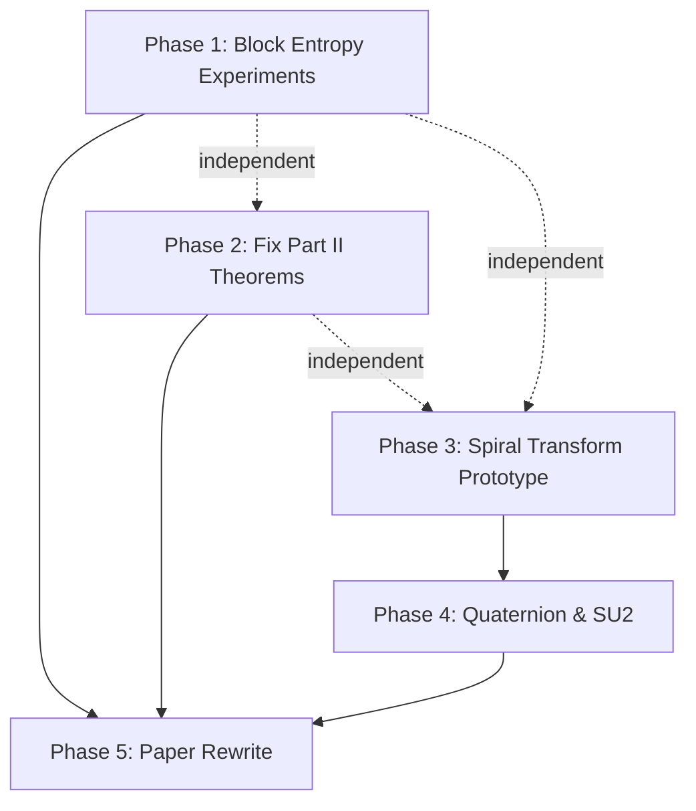

# Implementation Plan: Paper 2 — Spectral Compression & Geometric Encoding

## Overview

This plan restructures Paper 2 from a conversation-derived skeleton into a computationally grounded research paper. The strategy is **computation-first**: build the tools, generate the figures, discover what's actually true, *then* write the theorems.

The plan is divided into 5 phases. Each phase produces artifacts (scripts, figures, or LaTeX sections) that feed into the next.

---

## Phase 1: Block Entropy Experiments (Part I)
**Goal:** Reproduce and extend the original undergrad observation that motivated the paper.
**Estimated effort:** 1 session

### Task 1.1 — Block entropy sweep script
- [ ] Create `spectral-compression/scripts/block_entropy.py`
- **Input:** A binary string (or generator for structured strings)
- **Compute:** For each block size $n \in \{1, 2, 3, \dots, n_{\max}\}$ and shift $s \in \{0, \dots, n-1\}$:
  - Partition the (shifted, padded) string into $n$-bit blocks
  - Compute empirical symbol frequencies
  - Compute per-bit entropy $h_{n,s}$
  - Compute total compressed size = $h_{n,s} \cdot N + \text{metadata}(n, s, \text{dict})$
- **Output:** Table + plot of $h_{n,s}$ vs $(n, s)$, highlighting the minimum

### Task 1.2 — FFT period detection script
- [ ] Create `spectral-compression/scripts/fft_period.py`
- **Input:** Same binary strings from Task 1.1
- **Compute:**
  - Map $\{0,1\} \to \{-1, +1\}$
  - FFT → power spectral density
  - Extract $f_{\max}$, compute period $T = N / f_{\max}$
  - Extract phase $\phi(f_{\max})$, compute optimal shift $s^*$
- **Output:** PSD plot with annotated peak; comparison of FFT-predicted $(n^*, s^*)$ vs brute-force optimum

### Task 1.3 — Test on specific strings
- [ ] Structured strings: `01` repeated, `001` repeated, `0001110001110011` (mixed period), random
- [ ] Show at least one example where total compressed size (with metadata) is strictly less than $H_1 \cdot N$
- [ ] Show the failure mode: a random string where block entropy doesn't help

### Task 1.4 — Generate figures
- [ ] **Figure 1:** Per-bit entropy $h_n$ vs block size $n$ for 3–4 example strings (multi-panel)
- [ ] **Figure 2:** PSD of a periodic binary string with peak annotated
- [ ] Save to `spectral-compression/figures/`

### Deliverable
The motivating experimental evidence that was *missing* from the paper. Part I gets rewritten around these results.

---

## Phase 2: Fix Part II Theorems (Information Conservation)
**Goal:** Tighten the theoretical claims and add the missing computation.
**Estimated effort:** 1 short session

### Task 2.1 — Fix the "Gibbs Obstruction" theorem
- [ ] Rename to something accurate (e.g., "Degrees of Freedom Preservation")
- [ ] Separate the Gibbs phenomenon (an approximation artifact) from the actual obstruction (coefficient count = degrees of freedom)
- [ ] Add a clean proof based on rank of the Fourier transform as a linear map

### Task 2.2 — Tighten the Information Conservation Law
- [ ] Remove the $\epsilon$ parameter and state the clean version:
  > Any injective map $\Phi: \{0,1\}^N \to \mathbb{R}^M$ satisfying lossless reconstruction requires $M \geq N / B$ where $B$ is the bit-width per real parameter.
- [ ] Add the corollary: for 32-bit floats, storing $N$ bits via $N$ Fourier coefficients costs $32N$ bits — a $32\times$ expansion.

### Task 2.3 — Add the sinusoidal encoding computation
- [ ] Create `spectral-compression/scripts/sinusoidal_encoding.py`
- [ ] For a specific short binary string (~20 bits):
  - Construct the slope-modulated piecewise-linear curve
  - Compute its Fourier series coefficients
  - Count how many are needed for lossless reconstruction
  - Compare total storage vs original bit count
- [ ] **Figure 3:** The piecewise-linear curve for two contrasting strings (uniform vs alternating)
- [ ] **Figure 4:** Fourier coefficient magnitudes showing slow decay

### Deliverable
Part II becomes honest: the theorems say what they mean, and there's a concrete numerical example showing the inflation penalty.

---

## Phase 3: Spiral Transform Prototype (Part III — the core)
**Goal:** Build and validate the spiral dimensional reduction on real geometry.
**Estimated effort:** 2–3 sessions (this is the main event)

### Task 3.1 — Basic surface of revolution toolkit
- [ ] Create `spectral-compression/scripts/surface_revolution.py`
- **Implement:**
  - `axis_curve(s)` — parameterized axis (start with straight lines, then curves)
  - `frenet_frame(s)` — compute $(\mathbf{T}, \mathbf{N}, \mathbf{B})$ numerically
  - `surface_point(s, theta)` — compute $\gamma(s) + r(s)[\cos\theta\,\mathbf{N} + \sin\theta\,\mathbf{B}]$
  - `spiral_path(s, n)` — the helical path with $n$ windings
- [ ] Validate on a straight-axis vase (should recover classical surface of revolution)

### Task 3.2 — Radius signal extraction and Fourier analysis
- [ ] Create `spectral-compression/scripts/spiral_compression.py`
- **For a given surface:**
  - Sample $r(t)$ along the spiral path at high resolution
  - Compute FFT of $r(t)$
  - Plot coefficient magnitudes on log scale
  - Measure energy concentration: what fraction of total energy is in the top $K$ coefficients?
  - Reconstruct surface from top-$K$ coefficients, compute error
- [ ] Test surfaces:
  - **Cylinder** ($r = \text{const}$) — sanity check, should be 1 coefficient
  - **Sinusoidal vase** ($r(s) = 1 + 0.3\sin(2\pi s)$) — should need a few coefficients
  - **Torus cross-section** — more complex
  - **Bumpy surface** ($r(s) = 1 + 0.1\sin(10\pi s) + 0.05\sin(20\pi s)$) — test decay rate

### Task 3.3 — Curved axis demonstration
- [ ] Implement a non-trivial axis curve (e.g., a helix, or a smooth S-curve)
- [ ] Generate the generalized surface of revolution
- [ ] Extract and compress the spiral radius signal
- [ ] **Key question:** Does curvature of the axis affect the Fourier decay rate of $r(t)$?

### Task 3.4 — The inverse problem (unwrapping to cylinder)
- [ ] Given a 2D target curve, compute its evolute (the "straightening axis")
- [ ] Verify: wrapping around the evolute with constant radius reproduces the target
- [ ] Show the iterative smoothing effect (wrap → unwrap → wrap → approaches cylinder)
- [ ] Connect to the offset curve convergence result

### Task 3.5 — Generate figures
- [ ] **Figure 5:** A vase-like surface with spiral path overlaid (3D matplotlib plot)
- [ ] **Figure 6:** The radius signal $r(t)$ extracted from the spiral path
- [ ] **Figure 7:** Fourier coefficient decay (log-magnitude) for the vase vs random surface
- [ ] **Figure 8:** Reconstruction error vs number of retained coefficients
- [ ] **Figure 9:** Generalized surface around a curved axis
- [ ] **Figure 10:** The inverse problem — target curve, evolute, and resulting cylinder

### Deliverable
Computational evidence that the spiral transform produces a compressible signal for smooth surfaces, with quantified Fourier decay rates. This is the original contribution.

---

## Phase 4: Quaternionic Frame and SU(2) Connection
**Goal:** Make the quantum mechanics connection concrete rather than hand-wavy.
**Estimated effort:** 1 session

### Task 4.1 — Quaternion ODE solver
- [ ] Create `spectral-compression/scripts/quaternion_frame.py`
- **Implement:**
  - Unit quaternion representation (or use `scipy.spatial.transform`)
  - Numerical integration of $dq/ds = \frac{1}{2}q(s)\omega(s)$ along the axis
  - Extract $(\mathbf{T}, \mathbf{N}, \mathbf{B})$ from $q(s)$
  - Compare against the direct Frenet–Serret computation (should agree)

### Task 4.2 — Visualize the quaternion path
- [ ] Plot the path $q(s)$ on the 3-sphere $S^3$ (projected to 3D)
- [ ] Show how different axis curves produce different quaternion trajectories
- [ ] **Figure 11:** Quaternion trajectory for a helical vs planar axis curve

### Task 4.3 — Write the SU(2) connection cleanly
- [ ] The sandwich operator $v' = qvq^{-1}$ mapped to the $2\times2$ matrix representation
- [ ] Show numerically that the rotation matrix from the quaternion matches the Frenet frame
- [ ] This is the section where the paper connects to quantum mechanics — keep it tight and algebraic, don't overclaim

### Deliverable
The quaternionic framework is validated computationally, and the SU(2) connection is grounded in actual matrix computations rather than analogy.

---

## Phase 5: Paper Rewrite
**Goal:** Rewrite the LaTeX document around the computational results.
**Estimated effort:** 1–2 sessions

### Task 5.1 — Restructure the paper
**Decision point:** Unified paper or split Part III?

**Recommended: Keep unified** but with a different framing:
- **Title:** Keep current title (it's good)
- **Frame as:** "Three investigations connected by the question: when does a change of representation make data compressible?"
- **Part I:** Experimental + theoretical. Lead with the experiments, state the known results as context.
- **Part II:** Reframe as a "negative result" section. The theorems are about *why the naive approach fails*. Keep it concise (2–3 pages).
- **Part III:** This is the main event. Expand to 6–8 pages with all the figures and computations.

### Task 5.2 — Write missing proofs
- [ ] Proposition (Monotonicity): Add proof or cite Cover & Thomas
- [ ] Proposition (Dimensional Reduction): State precisely (dense image in the limit), prove using Weyl's equidistribution or a direct argument
- [ ] Non-degeneracy condition: Prove this is necessary and sufficient for the normal lines to be non-intersecting (this is the tubular neighborhood theorem)

### Task 5.3 — Add related work / bibliography
The paper currently has **zero references**. At minimum, cite:
- Cover & Thomas, *Elements of Information Theory* (block entropy, source coding theorem)
- Do Carmo, *Differential Geometry of Curves and Surfaces* (Frenet frame, evolutes)
- Altmann, *Rotations, Quaternions, and Double Groups* (quaternionic frames)
- Weyl, equidistribution theorem (for the spiral density argument)
- Existing work on generalized cylinders in computer graphics (Binford 1971, Marr & Nishihara 1978)

### Task 5.4 — Final compilation and review
- [ ] Compile LaTeX with all figures
- [ ] Verify all cross-references
- [ ] Read through for consistency of notation

---

## Dependency Graph

Phases 1, 2, and 3 can proceed in parallel. Phase 4 depends on Phase 3's surface toolkit. Phase 5 depends on everything.

## Recommended Order

| Session | Work | Why this order |
|---------|------|----------------|
| **1** | Phase 3, Tasks 3.1–3.2 | Build the core prototype first — this is the original contribution |
| **2** | Phase 3, Tasks 3.3–3.5 | Complete the computational evidence |
| **3** | Phase 1, all tasks | Quick wins — reproduce your undergrad experiments |
| **4** | Phase 2 + Phase 4 | Clean up the theory, validate quaternions |
| **5** | Phase 5 | Rewrite the paper around the results |
